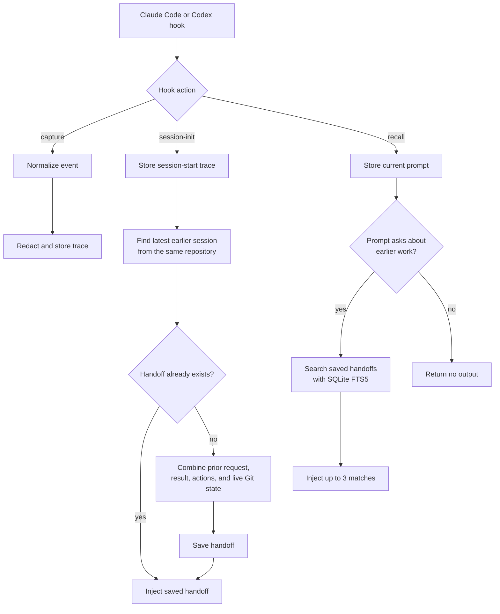
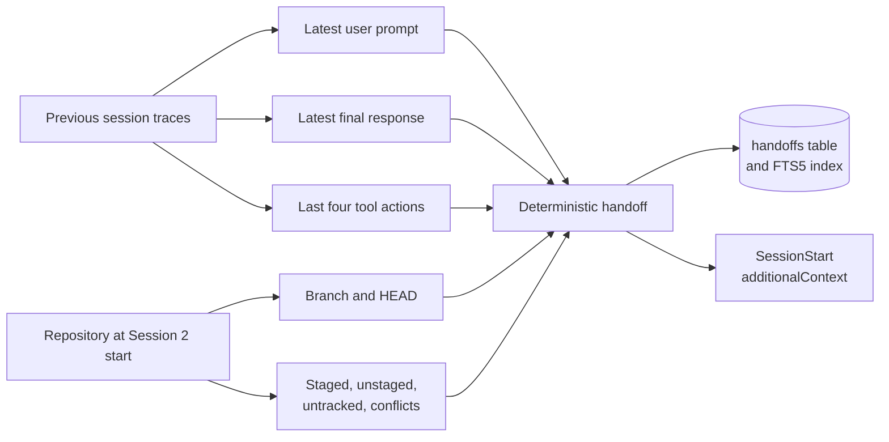
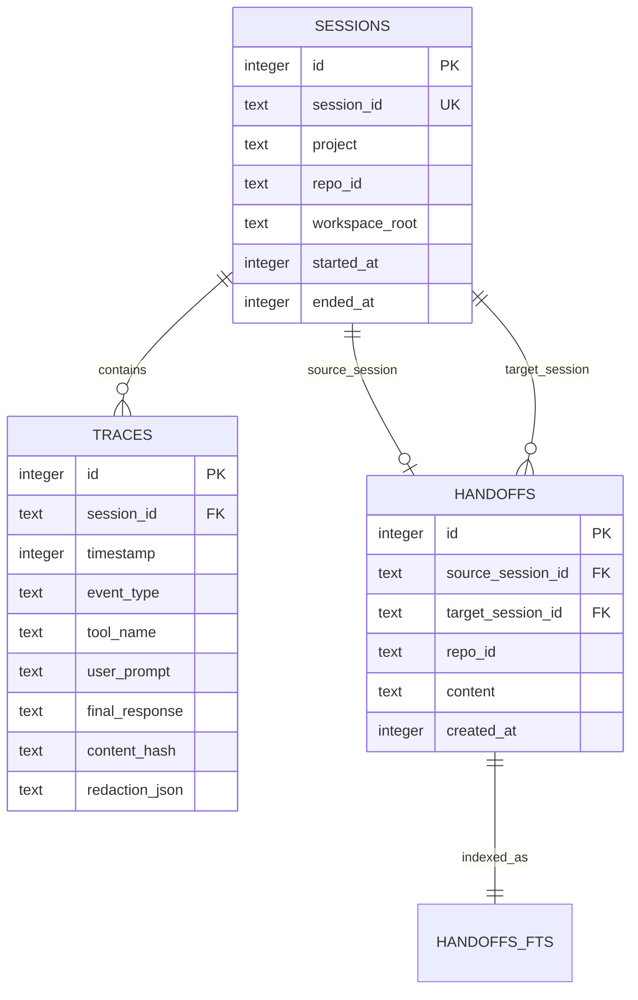

# Termyte Overview

Termyte gives a coding agent the context from the previous session in the same repository. It runs through agent hooks, stores a small local history, and injects a handoff before the next session's first response.

The current runtime supports Claude Code and Codex. It is local-first and uses SQLite. It has no background worker, external model call, embedding index, MCP server, cloud sync, or viewer.

## The End-to-End Flow

```mermaid
flowchart LR
  A[Developer runs<br/>termyte init] --> B[Termyte detects<br/>Claude Code or Codex]
  B --> C[Project hooks<br/>are installed]
  C --> D[Session 1 events]
  D --> E[Normalize and<br/>extract file paths]
  E --> F[Redact secrets]
  F --> G[(Local SQLite)]
  G --> H[Session 2 starts]
  H --> I[Load previous session<br/>and current Git state]
  I --> J[Build and save<br/>one handoff]
  J --> K[Inject handoff<br/>into the agent]
  K --> L[Agent continues<br/>with prior context]
```



There are three runtime paths: capture, session handoff, and explicit recall.



## 1. Setup

The user installs the package and runs:

```bash
npm install -g termyte
termyte init
```

`termyte init`:

1. Checks whether Claude Code or Codex is installed.
2. Asks the user to choose when both are available.
3. Writes project-level hook configuration under `.claude/settings.json` or `.codex/hooks.json`.
4. Saves the selected agent and database path in `~/.termyte/config.json`.
5. Creates and migrates the SQLite database.

The installer preserves unrelated hooks. It removes older Termyte hook entries before adding the current ones, so running setup again does not create duplicates.

## 2. Installed Hooks

Both agent integrations install the same four events:

| Agent event | Termyte action | Purpose |
|---|---|---|
| `SessionStart` | `session-init` | Capture the new session and inject the previous session's handoff. |
| `UserPromptSubmit` | `recall` | Capture the prompt and, when it asks about prior work, search saved handoffs. |
| `PostToolUse` | `capture` | Capture tool input, output, and file activity. |
| `Stop` | `capture` | Capture the agent's final response and mark the session as ended. |

Each hook runs `dist/cli/hook.js` with Node. Hook execution has a ten-second timeout and normally prints nothing. It writes JSON only when it has context to inject.

## 3. Event Capture

Claude Code and Codex send different raw hook payloads. Their adapters convert those payloads into one common event shape:

- session ID and timestamp
- event type
- tool name, input, and output
- user prompt or final response
- working directory
- files read or modified, when they can be detected

The supported event types are `session_init`, `user_prompt`, `tool_use`, `assistant_message`, and `session_end`.

The hook runner then:

1. Resolves the Git repository root from the event's working directory.
2. Builds a repository ID from the normalized `origin` URL. If there is no origin, it uses the root directory name.
3. Creates or updates the session row.
4. Extracts file paths from known file tools and common shell commands.
5. Sends the event to the store.
6. Marks the session ended after an assistant message or explicit session-end event.

Malformed payloads, missing session IDs, and invalid working directories are ignored. An unsupported platform or invalid command fails with an error.

## 4. Redaction and Idempotent Storage

Before a trace is written, Termyte redacts sensitive object fields and common secret formats. The rules cover values such as passwords, API keys, bearer tokens, GitHub tokens, AWS access keys, Slack tokens, JSON Web Tokens, private-key blocks, credentials in URLs, and secret-like environment assignments.

Redaction is heuristic. It lowers the chance of storing common secrets, but it cannot promise that every secret format will be found.

After redaction, Termyte hashes the event content. SQLite uniqueness rules prevent the same event from being inserted twice:

- Events with a platform event ID are unique by session and platform event ID.
- Other events are unique by session, event type, timestamp, and content hash.

SQLite runs in write-ahead logging mode with foreign keys enabled. The default database is `~/.termyte/termyte.db`. `TERMYTE_HOME` changes the Termyte directory, and `TERMYTE_DB` overrides the database path.

## 5. Building the Next-Session Handoff

When Session 2 starts, Termyte first records its `session_init` event. It then finds the latest earlier session with at least one trace and the same repository ID.



The handoff contains available parts of:

- the last user prompt from the previous session
- the last final response from the previous session
- the last four tool actions, with each rendered value limited to 1,500 characters
- the current branch, commit, changed files, staged and unstaged summaries, untracked files, and conflicts

The builder is deterministic. It does not ask a model to summarize the session. The handoff is saved once per source session and reused if the hook is called again.

The adapter formats the handoff as the agent's `additionalContext`. The instruction asks the agent to show awareness of it in the first response and continue from the stated next step without asking the developer to repeat the work.

If there is no earlier session, no trace data, no repository identity, or no usable workspace root, Termyte injects nothing.

## 6. Explicit Recall

Termyte also supports questions such as:

- "Why did we choose this?"
- "What happened last time?"
- "What did we try before?"

The recall path runs only when the new prompt contains a prior-work phrase such as `why`, `previous`, `last time`, `what happened`, `tried`, or `decision`.

Termyte extracts search terms from the prompt, searches the saved handoffs with SQLite FTS5, limits results to the current repository, and injects up to three matches. Recall searches handoffs, not every raw trace.

## Data Model



Only three durable concepts exist:

| Record | Role |
|---|---|
| Session | Identifies one agent session and connects it to a repository and workspace. |
| Trace | Stores one normalized, redacted hook event. |
| Handoff | Stores the context assembled from one source session for a later target session. |

`handoffs_fts` is an FTS5 virtual table maintained by insert, update, and delete triggers.

## Main Code Paths

| Area | Files | Responsibility |
|---|---|---|
| CLI | `src/cli/index.ts`, `src/cli/init.ts`, `src/cli/config.ts` | Setup, agent selection, config, and help. |
| Hook entry | `src/cli/hook.ts` | Reads hook JSON, selects capture, handoff, or recall, and writes agent output. |
| Agent support | `src/agents/adapters/*`, `src/agents/installers/*` | Normalize payloads, format output, and install hooks. |
| Capture | `src/capture/*` | Validate events, detect repository state, extract paths, and ingest traces. |
| Context | `src/context/builder.ts` | Build, save, and recall handoffs. |
| Storage | `src/storage/*` | Open SQLite, run migrations, and query sessions, traces, and handoffs. |
| Safety | `src/shared/redaction.ts` | Redact common secret fields and patterns before storage. |

## Runtime Boundaries

The current implementation intentionally does not include:

- background jobs or worker processes
- model-generated summaries
- embeddings, vector search, or ranking pipelines
- task, checkpoint, or memory lifecycle systems
- MCP or HTTP servers
- dashboards or management UI
- cloud storage or cross-device sync
- OpenCode or other agent adapters

Termyte's present scope is one local continuity loop: capture Session 1, build a handoff when Session 2 starts, and give that handoff to the same supported agent in the same repository.

## Verification Surface

The repository tests cover:

- Claude Code and Codex payload normalization
- trace capture, secret redaction, and handoff search
- hook installation and event mapping
- packaging, local installation, and capture through the built hook entry point

Use the full verification command after runtime changes:

```bash
npm run verify
```

These checks prove the source, package, and hook capture path. A real interrupted Session 1 to Session 2 run is a separate end-to-end product proof.

## Related Docs

- [README](README.md)
- [Getting started](docs/getting-started.md)
- [How it works](docs/how-it-works.md)
- [Contributing](CONTRIBUTING.md)
