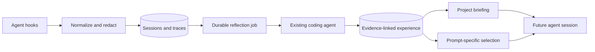

# Termyte implementation overview

Termyte is a local-first experience layer for Codex and Claude Code. The implemented MVP follows this loop:

## Runtime paths

| Path | Trigger | Result |
|---|---|---|
| Capture | Session, prompt, tool, and stop hooks | Sanitized local trace linked to repository and session. |
| Reflection | Meaningful session completion | One leased, retryable job and at most one experience per source session. |
| Session briefing | `SessionStart` | Repository profile, Git state, recent tasks, and earlier experience. |
| Prompt application | `UserPromptSubmit` | Up to four relevant experiences with supporting evidence. |

## Durable records

| Record | Authority |
|---|---|
| Session | Repository-scoped execution boundary. |
| Trace | Immutable captured evidence after redaction. |
| Experience | LLM-derived reusable lesson linked to one source session and evidence payload. |
| Reflection job | Retry, lease, and failure state for asynchronous experience creation. |
| Handoff | Legacy previous-session context retained for API compatibility. |

## Failure behavior

- Duplicate events, jobs, and experiences are idempotent.
- A crashed worker job becomes claimable after its lease expires.
- Invalid reflection output is retried and never persisted as experience.
- Internal agent calls do not recursively enter Termyte hooks.
- Prompt selection times out and falls back to local lexical relevance.
- Missing briefing or prompt context never prevents the coding agent from continuing.

## Main code paths

| Area | Files |
|---|---|
| Agent hooks and installers | `src/agents/`, `src/cli/hook.ts` |
| Capture and repository state | `src/capture/` |
| Storage and migrations | `src/storage/` |
| Agent-backed reflection | `src/reflection/`, `src/llm/` |
| Briefing and prompt context | `src/context/` |
| Verification | `test/` |

## Honest boundaries

The MVP does not train models, use embeddings, provide cloud sync, expose a dashboard, or understand code symbols and ASTs. Repository structure comes from package metadata, README text, paths, captured commands, files, and Git state. Passing unit and package tests proves the runtime contracts; the launch claim that Termyte improves task completion still requires controlled cross-agent trials.
