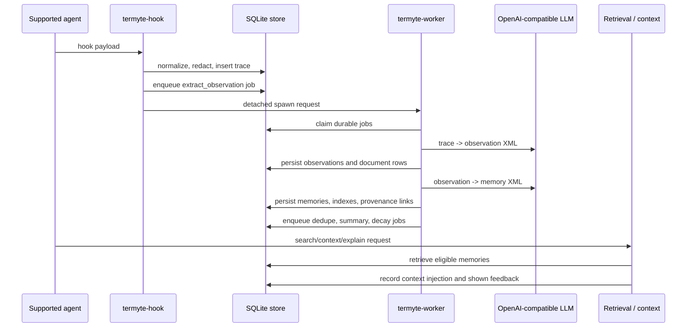

# Termyte Overview

Termyte is a local-first memory layer for coding agents. The codebase captures agent execution as immutable traces, derives observations and memories from those traces, and exposes retrieval through CLI, MCP, hook injection, and a local diagnostics viewer.

This repository is not a generic memory SDK and it is not yet a self-correcting system. The durable pipeline, provenance, feedback, lifecycle, and ranking pieces are real, but the closed loop that proves a memory helped or harmed a task and then repairs future retrieval is still incomplete.

## Quick Navigation

- [Repository Shape](#repository-shape)
- [System Architecture](#system-architecture)
- [Runtime Flow](#runtime-flow)
- [Storage Model](#storage-model)
- [Architect View](#architect-view)
- [Developer View](#developer-view)
- [Product View](#product-view)
- [What Is Solid](#what-is-solid)
- [What Is Partial](#what-is-partial)
- [Actionable Questions](#actionable-questions)

## Repository Shape

The code is organized around a small number of clear subsystems:

- `src/capture`: platform adapters, event normalization, and file-path extraction.
- `src/cli`: command-line entry points and per-command handlers.
- `src/context`: ranked context packing and injection tracking.
- `src/core`: shared types for traces, observations, memories, summaries, and states.
- `src/eval` and `src/benchmark`: evaluation harnesses and retrieval benchmarks.
- `src/explain`: provenance and lifecycle explanation rendering.
- `src/hooks`: platform-agnostic hook runner.
- `src/indexing`: sqlite-vec helpers for vector indexes.
- `src/integrations`: installers for Claude Code, Codex, Cursor, Gemini CLI, OpenCode, Windsurf, and MCP-only setups.
- `src/lifecycle`: decay, deduplication, and feedback state transitions.
- `src/mcp`: stdio MCP server, tool schema, and input validation.
- `src/observer`: prompts, XML parsing, and the LLM-backed observation pipeline.
- `src/pipeline`: durable jobs, worker execution, and worker supervision.
- `src/retrieval`: FTS, vector, hybrid search, ranking, and eligibility policy.
- `src/security`: deterministic redaction before persistence and LLM calls.
- `src/storage`: SQLite schema, migrations, document corpus, and repository state access.
- `src/synth`: agent-driven batch synthesis path and CLI adapters.
- `src/viewer`: local HTTP diagnostics viewer.

## System Architecture

```mermaid
flowchart LR
  subgraph Agents
    CC[Claude Code]
    CX[Codex]
    CS[Cursor]
    OC[OpenCode]
    GM[Gemini CLI]
    WS[Windsurf]
    RW[Raw payload]
  end

  CC --> AD[PlatformAdapter.normalize()]
  CX --> AD
  CS --> AD
  OC --> AD
  GM --> AD
  WS --> AD
  RW --> AD

  AD --> HR[HookRunner]
  HR --> RD[Redaction]
  RD --> TR[(traces)]
  HR --> Q[Durable jobs]

  Q --> WR[Detached termyte-worker]
  WR --> OP[Observer pipeline]
  OP --> OB[(observations)]
  OP --> MB[(memories)]
  OP --> SM[(summaries)]

  MB --> FT[FTS5]
  MB --> VX[sqlite-vec or scan fallback]
  FT --> HY[Hybrid search]
  VX --> HY
  HY --> CT[ContextBuilder]

  CT --> INJ[(context_injections)]
  CT --> INJITEM[(context_injection_items)]
  CT --> FB[(memory_feedback)]
  FB --> RK[Lifecycle and ranking]
  RK --> HY

  HY --> CLI[CLI / MCP / hook injection]
  CT --> CLI
  SM --> CLI
  OP --> DOC[(documents)]
  DOC --> DOCFTS[documents_fts]
  DOCFTS --> CLI
```

## Runtime Flow



The important runtime detail is that hooks do not do heavy work inline. They capture, persist, enqueue, and then ask the worker supervisor to start a detached worker. The worker drains the queue under leases and retries.

## Storage Model

The SQLite schema is the system's source of truth. Key tables and indexes:

| Area | Tables / Indexes | Role |
|---|---|---|
| Sessions and traces | `sessions`, `traces`, `idx_traces_*` | Immutable event capture and session scope. |
| Durable work | `jobs`, `jobs_ready_idx`, `jobs_lease_idx`, `jobs_subject_idx` | Leases, retries, backoff, dead letters, dedupe. |
| Derived knowledge | `observations`, `memories`, `summaries` | Structured observations, consolidated memories, session summaries. |
| Provenance | `trace_observations`, `observation_memories`, `memory_edges` | Explicit lineage and relationship edges. |
| Feedback | `memory_feedback`, `context_injections`, `context_injection_items` | Attribution of exposure, usage, correction, and ranked injection sets. |
| Search corpus | `documents`, `documents_fts`, `document_embeddings` | Typed retrieval for trace, observation, memory, summary, and episode documents. |
| Keyword search | `observations_fts`, `memories_fts` | FTS5 mirrors for derived knowledge. |
| Vector search | `memories_vec` plus dimension-specific document vec helpers | sqlite-vec acceleration where available, with fallback scanning. |

The store preserves repository, workspace, session, observation, and trace provenance through every derived artifact. JSON arrays are stored as text and embeddings are stored as Float32 blobs.

## Architect View

### What the architecture does well

- The system is layered cleanly: capture, persistence, queueing, enrichment, retrieval, and presentation are separated.
- Durable jobs are the core reliability primitive. The queue models leases, retries, backoff, failure, and dead letters explicitly.
- The worker supervision model is pragmatic for a local tool: hooks stay non-blocking, and a detached worker drains the queue after capture.
- Provenance is first-class. Traces, observations, memories, context injections, and feedback all retain durable links.
- Retrieval has sensible fallbacks. FTS is available even when embeddings fail, and vector search falls back when sqlite-vec is unavailable.

### Where the architecture is constrained

- SQLite is still the central runtime store, so scale is bounded by a single local database and local process orchestration.
- Vector search is partly accelerated and partly fallback-based. That is acceptable for the current product shape, but it is not a large-corpus architecture yet.
- The feedback loop is not closed. The system can record exposure and explicit feedback, but it cannot yet prove downstream task outcomes and adjust itself from those outcomes.
- Some subsystems are real but still conservative. Ranking uses a bounded multiplier over hybrid retrieval, and the calibration story is not finished.
- OpenCode still writes a placeholder context block rather than a full injected memory context.

### Architectural verdict

This is a strong local-first architecture for a coding-agent memory prototype. It is credible on durability, provenance, and inspectability. It is not yet a production-grade self-correcting memory platform because the evidence-to-outcome loop is incomplete.

## Developer View

### Code organization

The codebase is easy to navigate because most modules have one job:

- adapters normalize platform-specific payloads;
- the hook runner persists traces and kicks off work;
- the pipeline owns durable job execution;
- retrieval modules are split by search strategy;
- the context builder is the single place where ranked memories become injected text and durable attribution records;
- MCP, CLI, and viewer are thin surfaces over shared storage and retrieval code.

### Maintainability strengths

- TypeScript strict-mode ESM code with shared core types keeps the shape of the data model explicit.
- The observer uses a simple XML contract, which is easier to validate than free-form LLM text.
- Fallbacks are written into the code instead of hidden in docs: scan fallback for vectors, FTS-only fallback when embeddings fail, and no-crash behavior for broken hooks or launch failures.
- The test suite is feature-oriented. There are dedicated tests for adapters, hooks, queue behavior, lifecycle, retrieval, packaging, viewer, explanations, and benchmarks.

### Maintenance risks

- `Store` is a large coordination class. It is the natural abstraction boundary for SQLite access, but it also accumulates a lot of behavior.
- CLI and MCP each re-wire the same retrieval components. That is fine at this scale, but it increases the chance of surface drift.
- Some code paths are intentionally duplicated for pragmatic reasons, such as CLI context rendering and MCP context rendering. That should stay bounded and tested.
- The codebase contains a few partial products alongside complete ones, so docs need to stay synchronized with runtime behavior.

### Developer verdict

The repository is in good shape for a product built around SQLite and local processes. The main developer concern is not code style; it is controlling drift between the real runtime path and the partially complete surfaces that still need product work.

## Product View

### What the user actually gets

1. Install hooks or MCP config for a supported agent.
2. Capture agent execution into traces.
3. Let the background worker derive observations and memories.
4. Retrieve prior knowledge through search or injected context.
5. Inspect provenance and lifecycle with `explain`, `health`, `stats`, and the viewer.
6. Provide feedback that is stored durably and can influence ranking and future correction work.

### Main product surfaces

- `termyte-hook`: capture and optional event handling entry point.
- `termyte-worker`: durable queue drain and background processing.
- `termyte synth`: agent-driven batch synthesis of traces into observations.
- `termyte search`, `termyte context`, `termyte memory`, `termyte explain`: retrieval and explanation.
- `termyte mcp`: stdio server for MCP-capable IDEs.
- `termyte install`: writes platform-specific hook or MCP config.
- `termyte viewer`: local diagnostics server.
- `termyte eval` and `termyte bench run`: internal measurement surfaces.

### Product positioning

The code supports a focused local-first story: a provenance-rich memory layer for coding agents. That is stronger than a vague "AI memory" pitch because it keeps the product anchored to observable execution evidence.

It should not be positioned as:

- a broad general-purpose memory SDK;
- a fully self-correcting system;
- a hosted control plane;
- a replacement for generic vector databases or hosted memory platforms.

### Business value

The durable value proposition is trust. Users can inspect what was captured, how it was derived, how it was retrieved, and what feedback or correction followed. That is the right foundation for a coding-agent memory product because correctness and explainability matter more than raw feature count.

## What Is Solid

- Platform adapters cover Claude Code, Codex, Cursor, OpenCode, Gemini CLI, Windsurf, and raw payloads.
- Trace capture is immutable and persisted in SQLite.
- Durable jobs have leases, retries, backoff, and dead-letter handling.
- Worker supervision is non-blocking and detached.
- The observation and memory pipeline is real and traceable end to end.
- FTS5, local embeddings, sqlite-vec, and hybrid ranking are wired into actual retrieval paths.
- Context injections are attributed and persisted.
- Explicit feedback is stored and can feed ranking and correction workflows.
- Explanations can render provenance, edges, lifecycle fields, and feedback.
- The test surface is broad and feature-specific.

## What Is Partial

- The self-correction loop is not complete. Outcome attribution is still not closed end to end.
- Feedback-weight calibration is conservative and not yet grounded on public corpora.
- OpenCode still injects a placeholder AGENTS.md context block instead of a real retrieved context block.
- The current vector and benchmark story is not yet the final scale story. Some retrieval paths still rely on fallback scanning.
- Public benchmark loaders and some pipeline benchmark tracks are still not implemented.
- `termyte stats` still reports some retrieval health fields conservatively, even though the underlying runtime is more capable than the output suggests.

## Actionable Questions

1. Should the next major effort focus on closing the self-correction loop, or on proving scale and stability first?
2. Should OpenCode get real retrieved context injection instead of the placeholder AGENTS.md block?
3. Should the ranking weights be recalibrated against an independently labeled corpus before any broader product claims are made?
4. Is SQLite still the intended long-term center of the system, or should the vector/retrieval layer eventually move to a more scalable backend?
5. Should the viewer become a more complete operator console, or remain a thin local diagnostics page?
6. Which product claim should be tightened first in the docs: automatic correction, retrieval quality, or scale?

## Reference Files

- `src/cli/index.ts`
- `src/storage/migrations.ts`
- `src/storage/store.ts`
- `src/pipeline/memory-pipeline.ts`
- `src/context/builder.ts`
- `src/retrieval/hybrid.ts`
- `src/mcp/server.ts`
- `src/observer/pipeline.ts`
- `src/integrations/opencode-plugin/index.ts`
- `src/viewer/server.ts`
- `README.md`
- `PLAN.md`
